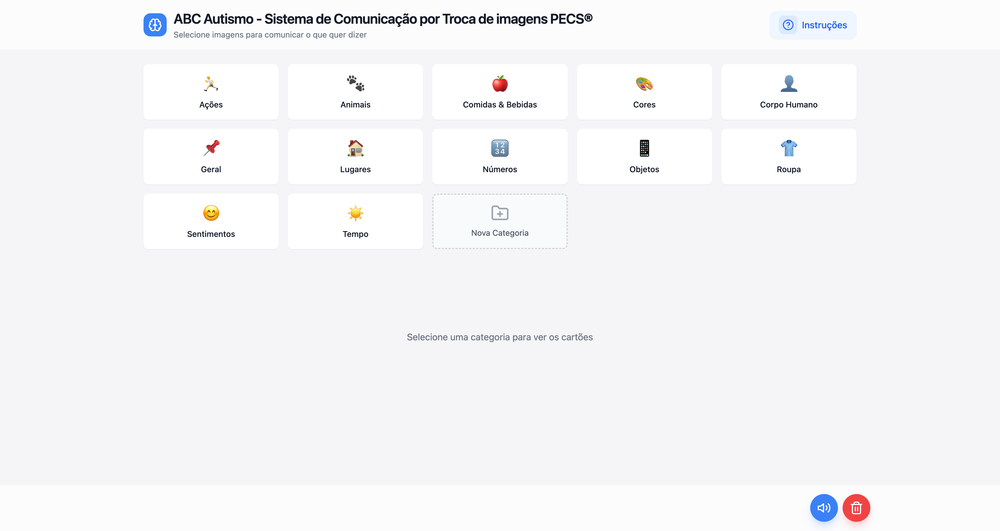

# AUTISMUS

COMO USAR O AUTISMUS?

A aplicação deve ser intuitiva, permitindo que os cuidadores, terapeutas ou pais adicionem imagens personalizadas para criar um sistema de comunicação adaptado às necessidades da criança. As imagens representam objetos, lugares, roupas, alimentos ou outras categorias essenciais para a comunicação.

Como Funciona:
1. Seleção de Imagens:
• As imagens são organizadas por categorias (ex.: Comida, Lugares, Roupa).

• A criança seleciona a imagem que corresponde ao que deseja comunicar, como "comer maçã" ou "ir ao parque."

2. Criação de Frases:
• A aplicação permite combinar imagens com texto ou áudio para formar frases simples, como "Quero comer" seguido da imagem de comida escolhida.

3. Interação e Feedback:
• Ao selecionar uma imagem, a aplicação pode reproduzir um som ou frase correspondente (ex.: "Maçã"). Isso reforça a associação visual e auditiva.

4. Personalização:
• É possível adicionar imagens importadas a partir do computador ou por URL.

• O texto ou som associado a cada imagem pode ser ajustado para refletir a linguagem usada pela criança.

5. Usar imagens PEC's na aplicação Autismus:
• Para puder usar a aplicação com imagens, fornecemos uma pasta zipada com as categorias todas.

• Depois de descarregar no computador, descompactar a pasta zipada.

• Adicione as imagens em cada categoria, usando a função "Adicionar imagem", ou seja, uma de cada vez.

• Adicione as imagens em cada categoria, usando a função "Upload em massa", ou seja, várias imagens.

• Porém, pode adicionar novas imagens nas categorias correspondentes.

• Carregue no Botão "Descarregar Imagens" para guardar no seu computador as imagens.

Objetivo:
A utilização das imagens facilita a comunicação funcional, reduz frustrações e incentiva a autonomia das crianças no espectro do autismo. A aplicação deve ser clara, com botões grandes e imagens de alta qualidade para promover uma experiência agradável e acessível.

Desenvolvedores da Autismus

Esta aplicação foi desenvolvida com o propósito de promover a inclusão e melhorar a comunicação de crianças no espectro do autismo. O conteúdo e as funcionalidades são projetados para facilitar a interação entre cuidadores, terapeutas e crianças, respeitando as necessidades individuais de cada utilizador. A reprodução, distribuição ou uso não autorizado de qualquer parte deste sistema é estritamente proibida. As imagens usadas nesta aplicação foram todas geradas com inteligência artificial. Obrigado por contribuir para um mundo mais acessível e inclusivo. O conteúdo está disponível sob a licença Creative Commons Attribution-NonCommercial-ShareAlike 4.0 International, permitindo a partilha e adaptação, desde que seja atribuído o devido crédito, para fins não comerciais, e com distribuição sob os mesmos termos. Juntos, construímos um mundo mais inclusivo e acessível.

Desenvolvido por Patrício Brito & Pedro Deleu © 2025 . Todos os direitos reservados.

Descarregar imagens: https://drive.google.com/file/d/1cWgL2x6OsNXAHwQGjMnmWJvGZUwkfiJI/view?usp=drive_link
